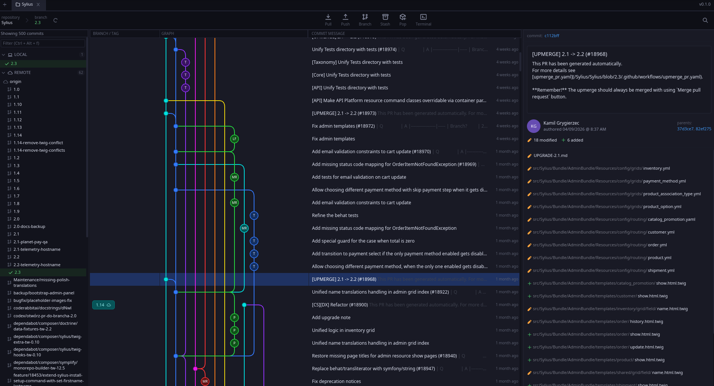

<div align="center">
  

  # Git Leviathan

  **A fast, native Git client for humans who like to see the shape of their history.**

  [](LICENSE)
  [](https://www.rust-lang.org/)
  [](https://iced.rs/)
</div>

---

<p align="center">
  
</p>

## Beta software
This is a brand new piece of software. Expect bugs and instability! If you encounter a bug, I would hugely appreciate if you'd create a new issue.

**Looking for MacOS and Windows users to test. Please let me know what issues you run into!**

## About

A lot of Git clients exist, but most of them still look like they are stuck in the '90s. The ones that do feel good to use are usually closed source, slow because they are built on Electron, or hard to shape around your own workflow.

Git Leviathan started as an attempt to solve all three problems at once: an open source Git client that is native, fast, and built to be extended. It is designed around the graph first, so branches, merges, tags, stashes, and release trains are visible as the shape of the project instead of hidden behind a flat log.

## Features

- **Graph-first history view** — follow branches, merges, tags, stashes, and long-lived maintenance lines without losing context.
- **Commit details at a glance** — select a commit and inspect the message, author, parents, changed files, and stats in one place.
- **Diff viewer with syntax highlighting** — read changes with tree-sitter based highlighting.
- **Media diffs** — images, audio and video open as old → new players instead of a binary blob. Images get zoom/pan, swipe, onion-skin and pixel-difference modes, animated GIF/APNG/WebP playback, SVG rendering and EXIF metadata; audio gets waveforms with scrubbing; video streams through FFmpeg with frame stepping and A/V sync. Exotic formats (HEIC, AVIF, JPEG XL, RAW, Opus, WMA, …) are handled by FFmpeg when it is installed.
- **Multi-tab workspace** — keep several repositories open side by side.
- **Plugin system** — extend the app with Lua plugins for commands, UI slots, dock panels, graph decorations, services, and more. Documentation coming soon.
- **Live filesystem watching** — the UI updates when your working tree does.
- **Structured error reporting** — auth failures, corrupt objects, and network issues surfaced with context, not stack traces.
- **Cross-platform** — Linux, macOS, and Windows.
- **Fully native, fully offline** — no Electron, no telemetry, no account.

## Installation

### Cargo (crates.io)

```bash
cargo install git_leviathan
```

This builds from source, so you need a recent Rust toolchain (see `rust-version` in
`Cargo.toml`). On Linux you also need the `fontconfig` and ALSA development headers
(`sudo apt-get install libfontconfig1-dev libasound2-dev` on Debian/Ubuntu,
`fontconfig alsa-lib-devel` on Fedora, `fontconfig alsa-lib` on Arch). libgit2, SQLite
and LuaJIT are vendored, so nothing else is required.

Video previews (and a few exotic image/audio formats) are decoded by the `ffmpeg` and
`ffprobe` executables at runtime. They are optional: without them images and common
audio formats still work, and video files show a message explaining what to install.

The binary is installed as `git_leviathan` in `~/.cargo/bin`. Note that this route
installs the executable only — it does not register a desktop entry or icons; use one
of the packages below if you want the app to show up in your application launcher.

### Pre-built binaries

Pre-built binaries for every tagged release are available on the [Releases page](https://github.com/shinyvision/git-leviathan/releases). Pick the asset that matches your platform:

| Platform | Architecture | Asset |
|----------|--------------|-------|
| Debian / Ubuntu | x86_64 | `git-leviathan_<version>-1_amd64.deb` |
| Debian / Ubuntu | arm64 | `git-leviathan_<version>-1_arm64.deb` |
| Fedora / RHEL / openSUSE | x86_64 | `git-leviathan-<version>-1.x86_64.rpm` |
| Fedora / RHEL / openSUSE | arm64 | `git-leviathan-<version>-1.aarch64.rpm` |
| Other Linux (portable) | x86_64 | `git-leviathan-<version>-linux-amd64.tar.gz` |
| Other Linux (portable) | arm64 | `git-leviathan-<version>-linux-arm64.tar.gz` |
| macOS (Apple Silicon) | arm64 | `git-leviathan-<version>-aarch64-apple-darwin.tar.gz` |
| Windows | x86_64 | `git-leviathan-<version>-x86_64-pc-windows-msvc.zip` |

> Replace `<version>` with the release you're downloading (e.g. `0.1.0`).

### Debian / Ubuntu

```bash
sudo dpkg -i git-leviathan_<version>-1_amd64.deb
sudo apt-get install -f   # pull in any missing dependencies
```

### Fedora / RHEL / openSUSE

```bash
sudo dnf install ./git-leviathan-<version>-1.x86_64.rpm
# or: sudo rpm -i git-leviathan-<version>-1.x86_64.rpm
```

### Any Linux (portable tarball)

Extract the archive to `/` to install system-wide (binary goes to `/usr/bin`, desktop entry and icons land in `/usr/share`):

```bash
sudo tar -xzf git-leviathan-<version>-linux-amd64.tar.gz -C /
sudo gtk-update-icon-cache /usr/share/icons/hicolor   # optional, refreshes icon cache
```

To uninstall:

```bash
sudo rm /usr/bin/git_leviathan \
        /usr/share/applications/git-leviathan.desktop \
        /usr/share/icons/hicolor/*/apps/git-leviathan.png
```

### macOS (Apple Silicon)

```bash
tar -xzf git-leviathan-<version>-aarch64-apple-darwin.tar.gz
mv "git-leviathan-<version>-aarch64-apple-darwin/Git Leviathan.app" /Applications/
```

The app is **not signed or notarized**. The first time you launch it, macOS will block it — right-click `Git Leviathan.app` → **Open**, then confirm. After that it launches normally.

### Windows

1. Download `git-leviathan-<version>-x86_64-pc-windows-msvc.zip`.
2. Extract it somewhere permanent (e.g. `C:\Program Files\Git Leviathan\`).
3. Run `git_leviathan.exe`. Optionally create a Start Menu shortcut.

SmartScreen may warn on first launch — click **More info** → **Run anyway**.

### Build from source

Requires a recent Rust toolchain. On Linux you also need the `fontconfig` and ALSA
development headers.

```bash
# Linux prerequisites (Debian/Ubuntu)
sudo apt-get install libfontconfig1-dev libasound2-dev

git clone https://github.com/shinyvision/git-leviathan.git
cd git-leviathan
cargo build --release
./target/release/git_leviathan
```

To build a distributable package yourself:

```bash
cargo install cargo-deb cargo-generate-rpm
cargo deb                 # -> target/debian/*.deb
cargo generate-rpm        # -> target/generate-rpm/*.rpm
```

## Tech Stack

| Area | Crate |
|------|-------|
| GUI | [`iced`](https://crates.io/crates/iced) 0.14 |
| Git | [`git2`](https://crates.io/crates/git2) 0.19 (vendored libgit2) |
| Async | [`tokio`](https://crates.io/crates/tokio) 1 |
| Persistence | [`rusqlite`](https://crates.io/crates/rusqlite) 0.32 (bundled) |
| Syntax highlighting | [`tree-sitter`](https://crates.io/crates/tree-sitter) 0.26 + [`tree-sitter-language`](https://crates.io/crates/tree-sitter-language) |
| Plugin runtime | [`mlua`](https://crates.io/crates/mlua) 0.10 (vendored LuaJIT) |
| Filesystem watching | [`notify`](https://crates.io/crates/notify) 7 |
| Terminal support | [`portable-pty`](https://crates.io/crates/portable-pty) + [`vt100`](https://crates.io/crates/vt100) |
| Text shaping | [`swash`](https://crates.io/crates/swash) |
| Image decoding | [`image`](https://crates.io/crates/image) 0.25 + [`resvg`](https://crates.io/crates/resvg) + [`kamadak-exif`](https://crates.io/crates/kamadak-exif) |
| Audio decoding / output | [`symphonia`](https://crates.io/crates/symphonia) 0.5 + [`cpal`](https://crates.io/crates/cpal) 0.17 |
| Video | FFmpeg (`ffmpeg`/`ffprobe` subprocesses, optional at runtime) |

## License

Released under the [MIT License](LICENSE). © 2026 Rachel Snijders.
